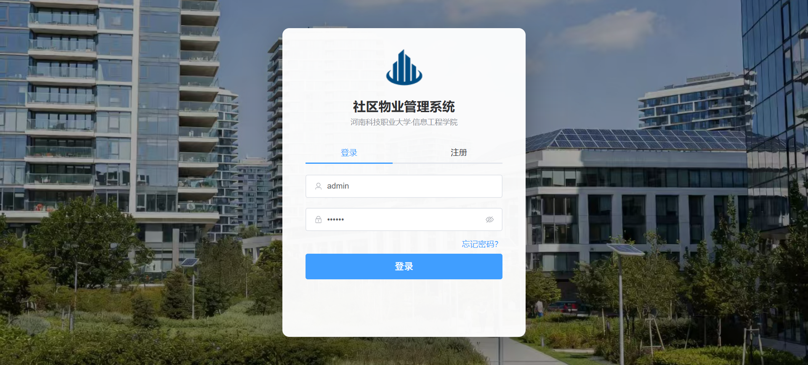
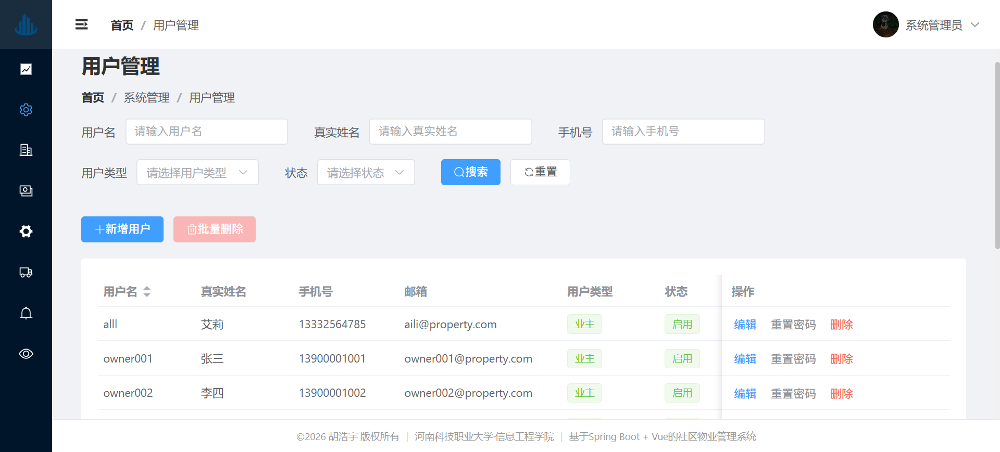
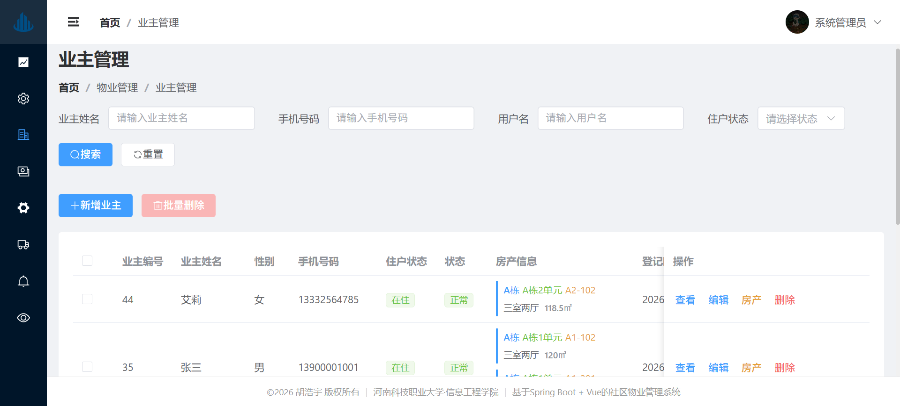
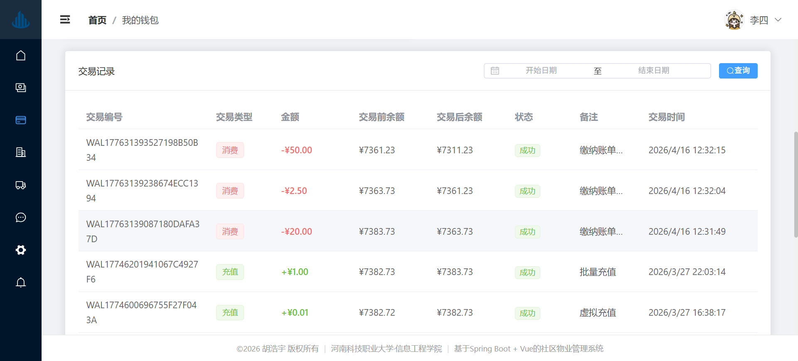
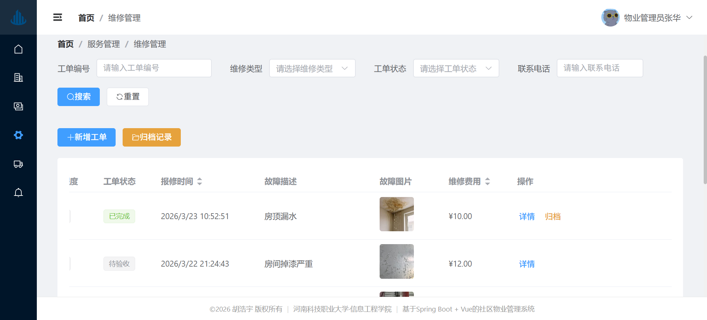
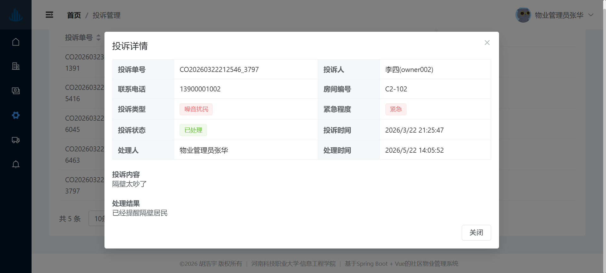
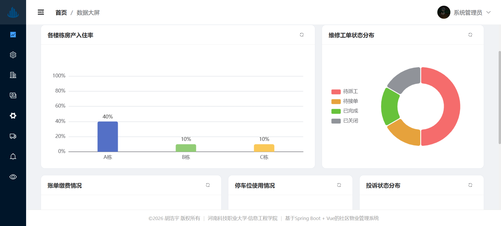

# 智慧小区物业管理系统

一个基于 Spring Boot + Vue 的社区物业管理系统，采用前后端分离架构，覆盖物业基础资料、费用账单、在线缴费、报修投诉、停车租赁、公告通知、数据统计和系统权限管理等常见小区物业业务场景。

## 项目简介

本项目面向社区物业管理中的日常业务流转，提供管理员端、物业端、业主端和维修人员端等多角色功能。后端提供 RESTful API、JWT 鉴权、RBAC 权限控制、操作日志和定时任务能力；前端基于 Vue 3 和 Element Plus 构建管理后台与业主门户。

## 技术栈

### 前端

| 技术 | 说明 |
| --- | --- |
| Vue 3 | 前端核心框架 |
| Vite | 前端构建工具与本地开发服务 |
| Element Plus | 后台管理界面组件库 |
| Vue Router | 前端路由管理 |
| Pinia | 状态管理 |
| Axios | HTTP 请求封装 |
| ECharts | 数据统计图表 |
| Sass | 样式预处理 |

### 后端

| 技术 | 说明 |
| --- | --- |
| Spring Boot 2.7.18 | 后端应用框架 |
| Spring Security | 登录认证与接口鉴权 |
| JWT | 无状态 Token 认证 |
| MyBatis-Plus | 数据访问层增强工具 |
| MySQL 8 | 业务数据存储 |
| Redis | 验证码、缓存等临时数据存储 |
| Knife4j | 在线接口文档 |
| Lombok / Hutool / FastJSON | 常用开发工具库 |
| Apache POI | Excel 导入导出 |

## 功能模块

- **认证与权限**：登录、注册、验证码、JWT Token、角色权限、菜单权限、按钮级权限控制。
- **系统管理**：用户管理、角色管理、菜单管理、字典管理、系统配置、登录日志、操作日志。
- **物业管理**：楼栋管理、单元管理、房产管理、业主管理、用户房产绑定。
- **费用管理**：费用类型维护、账单生成、账单查询、批量导出、批量打印、电子收据。
- **钱包缴费**：业主钱包、充值、支付密码、账单支付、交易流水。
- **服务管理**：投诉提交与处理、维修报修、派工、接单、完成、验收、评价。
- **停车管理**：车位管理、车位租赁申请、审核、合同生成、到期提醒、退租处理。
- **公告通知**：公告发布、置顶、撤回、业主阅读、阅读统计。
- **数据统计**：管理员数据大屏、物业工作台统计、费用与服务数据图表。
- **定时任务**：周期账单生成、车位租赁合同到期检查、过期合同释放。

## 系统截图

### 登录页

<p align="center">
  
</p>

### 用户管理

<p align="center">
  
</p>

### 业主管理

<p align="center">
  
</p>

### 账单管理

<p align="center">
  
</p>

### 维修管理

<p align="center">
  
</p>

### 车位租赁合同

<p align="center">
  
</p>

### 数据统计

<p align="center">
  
</p>

## 项目结构

```text
zhihui-xiaoqu-backend/
├── db/
│   ├── property_management.sql          # 数据库建表脚本
│   └── minute/ daily/                   # 数据库备份文件
├── docs/
│   └── images/                          # README 使用的系统截图
├── property-management-backend/          # Spring Boot 后端服务
│   ├── src/main/java/com/hyu/
│   │   ├── common/                       # 通用响应、异常、工具类
│   │   ├── controller/                   # 登录认证接口
│   │   ├── framework/                    # 安全、配置、AOP 等基础能力
│   │   ├── property/                     # 物业业务模块
│   │   └── system/                       # 系统管理模块
│   ├── src/main/resources/
│   │   ├── application.yaml              # 后端配置文件
│   │   └── mapper/                       # MyBatis XML 映射文件
│   └── pom.xml
└── smart-property-management/            # Vue 前端项目
    ├── src/
    │   ├── api/                          # 接口请求封装
    │   ├── components/                   # 通用组件
    │   ├── router/                       # 路由配置
    │   ├── stores/                       # Pinia 状态管理
    │   ├── utils/                        # 请求、权限、校验等工具
    │   └── views/                        # 页面模块
    ├── package.json
    └── vite.config.js
```

## 快速开始

### 环境要求

- JDK 1.8+
- Maven 3.6+
- Node.js 18+
- MySQL 8.0+
- Redis 6.0+

### 1. 准备数据库

创建数据库并导入脚本：

```bash
mysql -u root -p -e "CREATE DATABASE property_management DEFAULT CHARACTER SET utf8mb4 COLLATE utf8mb4_unicode_ci;"
mysql -u root -p property_management < db/property_management.sql
```

如果数据库用户名、密码或端口不同，需要修改后端配置：

```yaml
# property-management-backend/src/main/resources/application.yaml
spring:
  datasource:
    url: jdbc:mysql://localhost:3306/property_management
    username: root
    password: 123456
  data:
    redis:
      host: localhost
      port: 6379
```

### 2. 启动后端

```bash
cd property-management-backend
mvn spring-boot:run
```

后端默认运行在：

```text
http://localhost:8080
```

Knife4j 接口文档地址：

```text
http://localhost:8080/doc.html
```

### 3. 启动前端

```bash
cd smart-property-management
npm install
npm run dev
```

前端默认运行在：

```text
http://localhost:3000/login
```

开发环境接口地址配置位于：

```text
smart-property-management/.env.development
```

默认配置为：

```env
VITE_APP_API_BASE_URL=http://localhost:8080/api/v1
```

## 核心接口

| 模块 | 接口前缀 | 说明 |
| --- | --- | --- |
| 认证 | `/api/v1/auth` | 登录、注册、验证码、用户信息、Token 刷新 |
| 系统管理 | `/api/v1/system` | 用户、角色、菜单、字典、日志 |
| 物业管理 | `/api/v1/property` | 楼栋、单元、房产、业主、账单、钱包、投诉、维修、公告 |
| 停车租赁 | `/api/v1/parking` | 车位租赁申请、审核、合同 |
| 业主门户 | `/api/v1/portal` | 业主账单、钱包、房产、车位、投诉、报修信息 |
| 工作台 | `/api/v1/workbench` | 维修人员工单与工作统计 |
| 数据统计 | `/api/v1/dashboard` | 管理端与物业端统计数据 |

## 角色说明

| 角色 | 说明 |
| --- | --- |
| 系统管理员 | 管理系统用户、角色、权限、字典、日志和数据大屏 |
| 物业管理员 | 管理房产、业主、账单、投诉、维修、车位和公告 |
| 业主 | 查看房产、账单、钱包、车位、公告，提交投诉和报修 |
| 维修人员 | 查看待接单、进行中、待验收、已完成工单并处理维修流程 |

## 业务流程示例

### 维修工单流程

```text
业主提交报修 -> 物业派工 -> 维修人员接单 -> 维修完成 -> 业主验收 -> 服务评价
```

### 账单缴费流程

```text
维护费用类型 -> 生成账单 -> 业主查看账单 -> 钱包充值 -> 在线缴费 -> 生成收据
```

### 车位租赁流程

```text
业主提交租赁申请 -> 物业审核 -> 生成租赁合同 -> 合同生效 -> 到期提醒/自动释放
```

## 开发说明

- 前端请求统一封装在 `smart-property-management/src/utils/request.js`。
- 前端接口模块位于 `smart-property-management/src/api`。
- 后端统一响应对象为 `AjaxResult`，分页响应对象为 `PageResult`。
- 后端接口鉴权基于 Spring Security + JWT，认证过滤器为 `JwtAuthenticationTokenFilter`。
- 操作日志通过 AOP 切面记录，相关逻辑位于 `framework/aspectj/OperLogAspect.java`。
- 数据库脚本位于 `db/property_management.sql`。

## 注意事项

- `application.yaml` 中的数据库密码、JWT 密钥等配置适合本地开发，部署到生产环境时建议改为环境变量或独立配置文件。
- 数据库脚本主要包含表结构；如果本地没有初始化账号，需要先通过注册接口或手动插入用户数据创建可登录账号。
- Redis 需要先启动，否则验证码、缓存等依赖 Redis 的功能可能无法正常使用。
- 上传文件默认保存到后端项目的 `uploads` 目录。

## License

本项目主要用于学习、课程设计与物业管理系统实践场景，可根据实际需要自行扩展。
